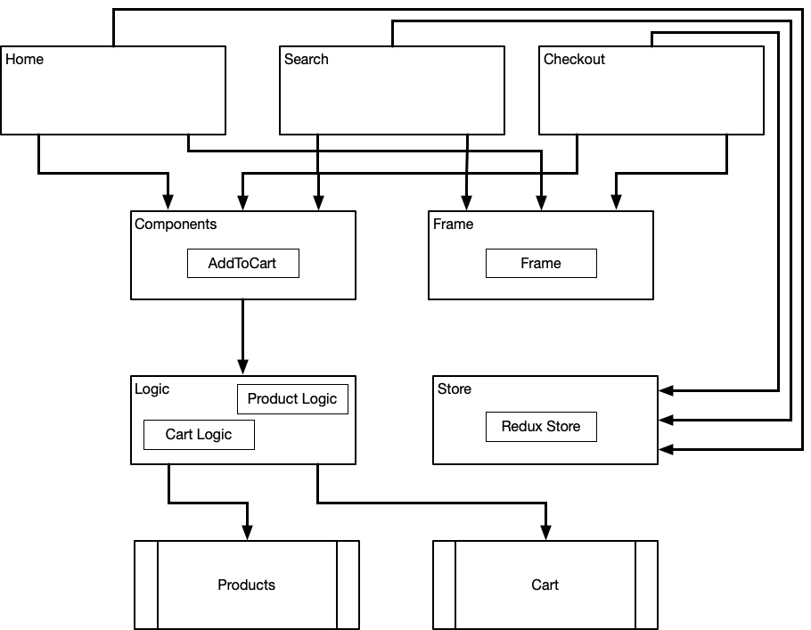
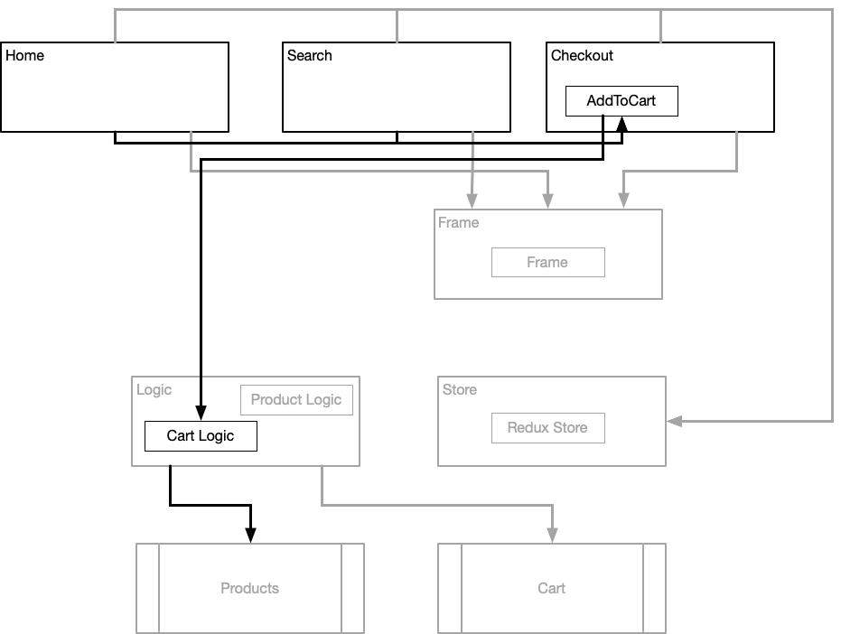
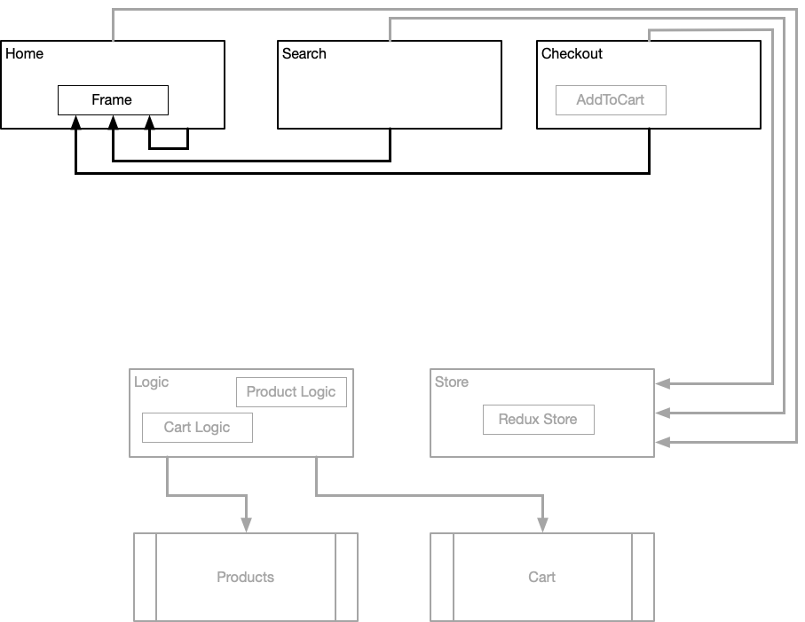
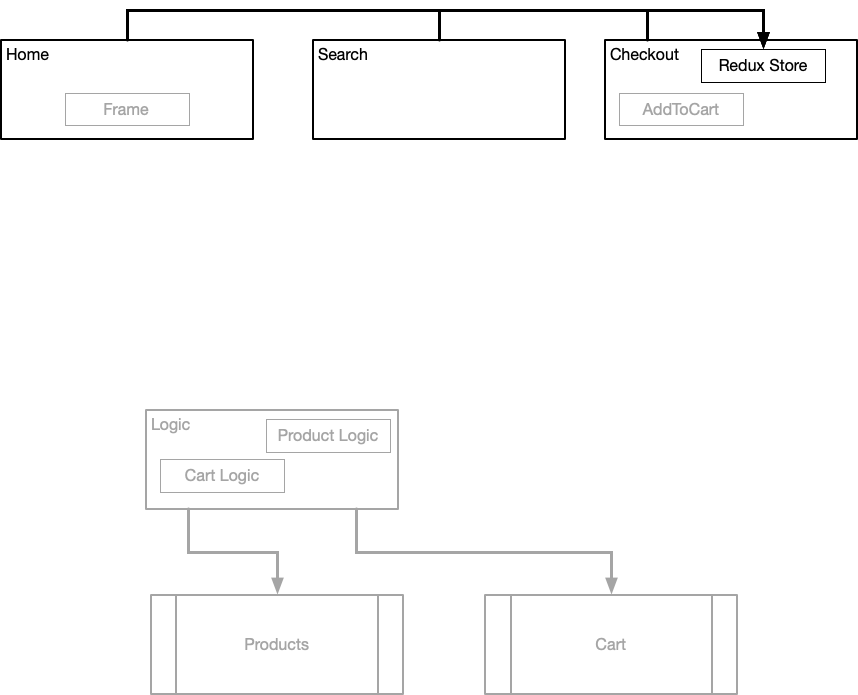
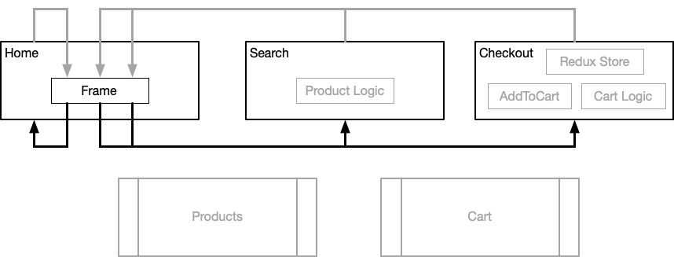
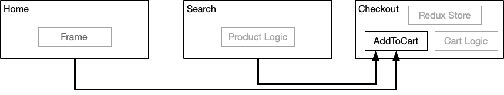
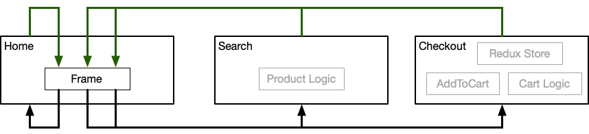
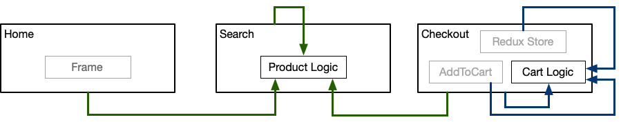
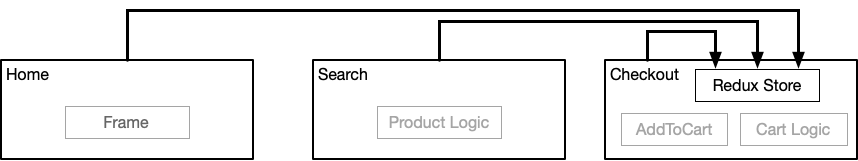

Migration from Non-Federated to Federated
=========================================

We start off with a system that looks like this:

# Initial Non-Federated Site

# Conversion To A Federated Site

## Step 1 - Moving AddToCart into Checkout

We bring the `AddToCart` React component into the `checkout` application and share it out to `home` and `search`.

## Step 2 - Moving Frame into Home

We move the `Frame` React component into the `home` application and share it out to all the applications, including home.

The implementation of `Frame` remains the same though. We will move to React Router and do the Single Page Application work in Step 5.

## Step 3 - Moving Redux store into Checkout

We move the Redux store into the `checkout` application, which makes the most sense since it's mostly about the cart. All the applications then consume it from there.

## Step 4 - Moving API Wrappers (logic)

We take the API functions that talk to the `product` service and move them into the `search` app since it's mainly working with the product catalog. And the API handlers for the `cart` service go into the `checkout` app.

## Step 5 - Porting to React Router

We export all the React components that have the body content for the applications, and have `Frame` consume those and use `react-router-dom` for SPA based navigation.

# End State

Both `home` and `search` both use the `AddToCart` React component from `checkout`.

All the applications use `Frame` from the `home` application, and it in turn connects to all the applications to get the routes.

All the applications talk to the API wrapper functions for the product endpoints. Only the `checkout` application use the API wrapper functions for the cart endpoints, but they remain available for anyone to use directly.

The three applications all bring in the Redux store and pass it to `Provider`. That could probably be simplified and just be incorporated into `Frame`.

